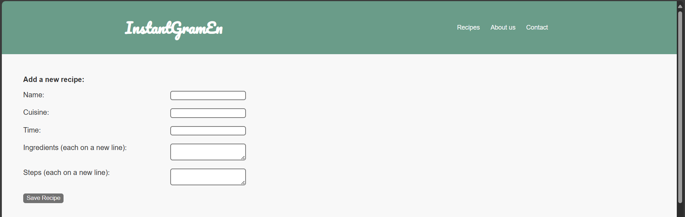
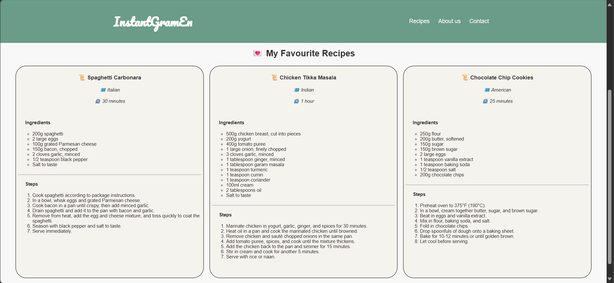

# Couch-to-Coder-2025
Code snippets and projects completed as a part of Bright Network's Couch to Coder 2025 course!

## Lessons
- ✒️ [Week 1 - Introduction to Programming](/week_1/)
- ✒️ [Week 2 - Data structures](/week_2/)
- ✒️ [Week 3 - Back-end basics](/week_3/)
- ✒️ [Week 4 - Front-end basics](/week_4/)
- ✒️ [Week 5 - Full-stack](/week_5/)
- ✒️ [Week 6 - Advanced CSS](/week_6/)
- ✒️ Week 7 - The fundamentals of data analysis

## Final Product
#### 📁 Files
**Backend:** [📄`index.js`](./week_3/server/index.js)

**Frontend:**[📄`app.js`](./week_5/app.js) [📄`index.html`](./week_4/index.html) [📄`styles.css`](./week_6/styles.css)
#### 📸 Preview

